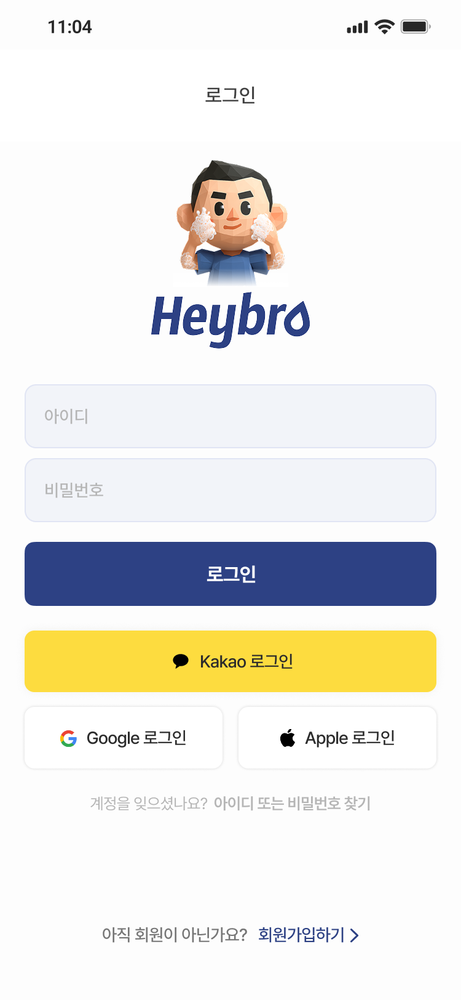
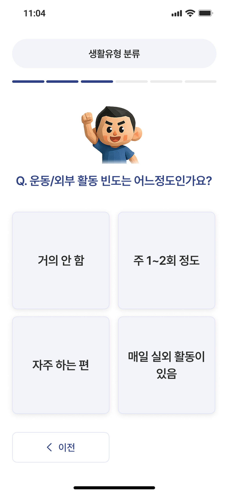
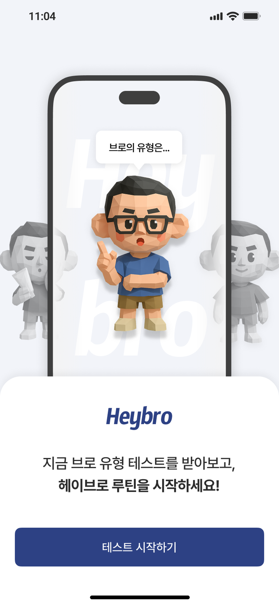
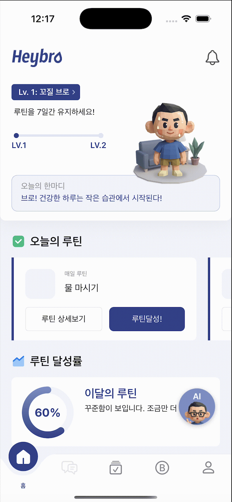
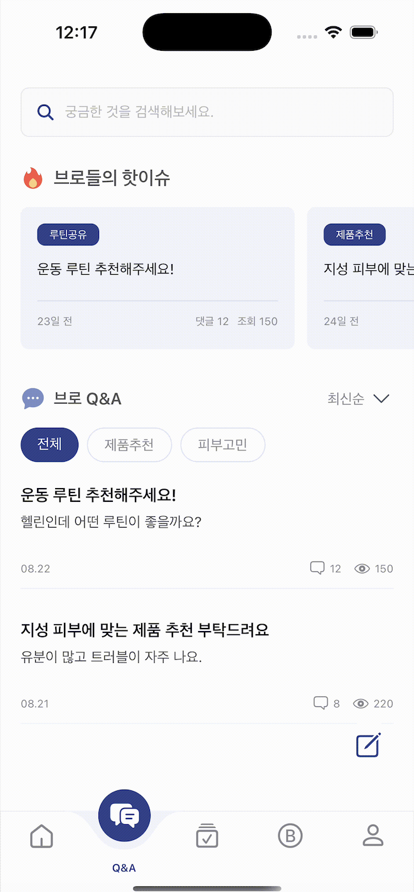
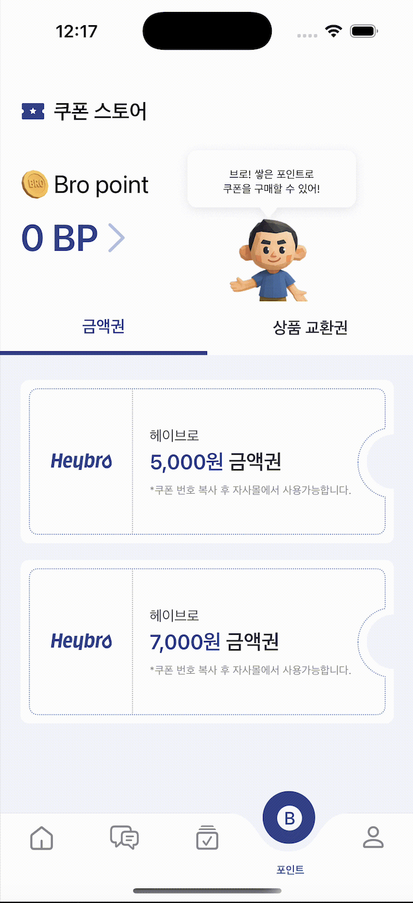
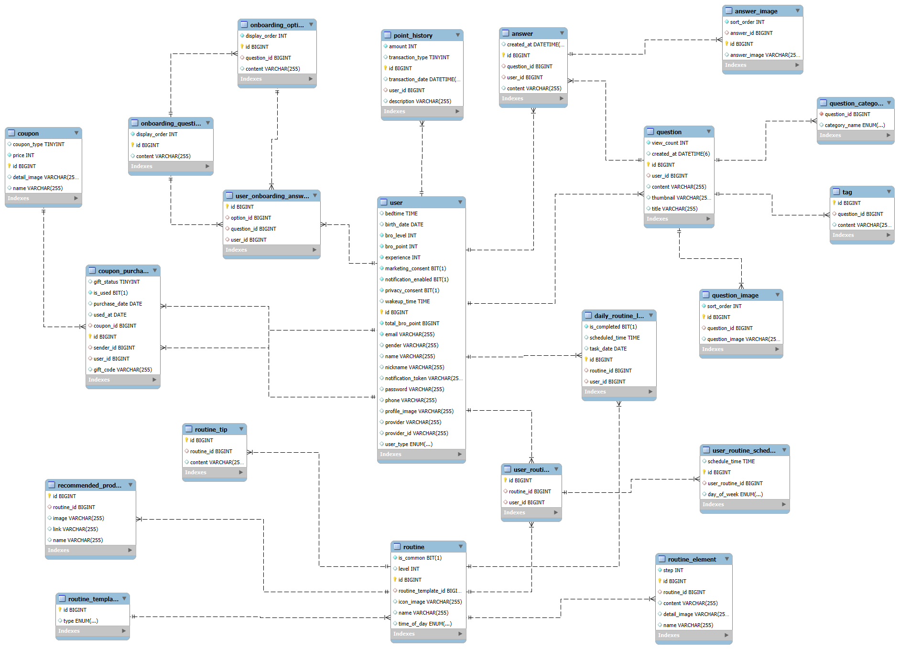

# 🧔🏻‍♂️ HEYBRO — 남성 그루밍 루틴 서비스

## 프로젝트 기간 및 팀원

- **팀명** : 김이박이
- **프로젝트 기간** : 2025.07.28 ~ 2025.09.05 (6주)

<table>
  <tr>
    <td align="center" width="50%">
      
    </td>
    <td align="center" width="50%">
      
    </td>
  </tr>
  <tr>    
    <td align="center">
      <a href="https://github.com/kn9012">
        
김유나

      </a>
    </td>
    <td align="center">
      <a href="https://github.com/kimyusan">
        
이권민

      </a>
    </td>
  </tr>
  <tr>    
    <td align="center">
     <b>Backend</b>
    </td>
    <td align="center">
      <b>Frontend</b>
    </td>
  </tr>
   <tr>
    <td>
      <ul>
        <li>Spring Boot 기반 백엔드 서버 개발</li>
        <li>Github Actions와 Docker를 활용한 CI/CD 파이프라인 구축</li>
      </ul>
    </td>
    <td>
      <ul>
        <li><b>프론트엔드 단독 개발</b>: 온보딩, 루틴 추천, AI 피부 측정, 알림, 쿠폰·포인트 시스템 등</li>
        <li><b>아키텍처 설계</b>: TypeScript 계층 분리, Zustand/Jotai 상태관리, 공용 컴포넌트 구조화</li>
        <li><b>성능 최적화</b>: iOS URLSession 네이티브 브릿지, FastImage 캐시, 로딩 인디케이터 적용</li>
        <li><b>OAuth 연동</b>: Google/Kakao/Apple 소셜 로그인 + JWT 인증</li>
        <li><b>커스텀 컴포넌트 구현</b>: 네비게이션바, DayRing 등 reanimated와 GPU 컴포넌트로 커스텀.</li>
        <li><b>디자인 협업</b>: Figma → Tailwind 스타일 가이드 기반 UI 구현</li>
      </ul>
    </td>
  </tr>
 
  <tr>    
    <td align="center">
      <a href="https://github.com/kn9012">
        
박지호

      </a>
    </td>
    <td align="center">
      <a href="https://github.com/kimyusan">
        
이윤재

      </a>
    </td>
  </tr>
  <tr>    
    <td align="center">
     <b>Designer</b>
    </td>
    <td align="center">
      <b>Designer</b>
    </td>
  </tr>
   <tr>    
    
  </tr>
</table>

## 개요

최근 남성 뷰티 시장이 꾸준히 성장하며, 스킨케어를 비롯한 자기관리에 대한 남성들의 관심이 그 어느 때보다 높습니다. 하지만 대다수가 정보 과잉 속에서 **나에게 맞는 방법**을 찾지 못하거나, **동기 부여 부족**으로 꾸준한 실천에 어려움을 겪는 페인 포인트를 가지고 있습니다.

HEYBRO는 이러한 문제점을 해결하기 위해 탄생했습니다. 저희는 사용자 개개인의 피부 타입, 라이프스타일, 목표를 분석하여 가장 효과적인 맞춤형 루틴을 제공합니다. 또한, 주기적인 알림과 성취감을 높이는 리워드 시스템을 통해 자기관리가 작심삼일로 끝나지 않고 즐거운 습관으로 자리 잡을 수 있도록 돕습니다. **HEYBRO와 함께 남성들이 꾸준한 자기관리를 통해 자신감을 얻고, 더 나은 일상을 만드는 것을 목표로 합니다.**

## 개발 환경

### 💻 IDE

- Visual Studio Code
- IntelliJ IDEA
- Xcode

### 🎨 FrontEnd

- React Native 0.73
- TypeScript
- Jotai
- React Navigation
- react-native-reanimated
- react-native-fast-image
- react-native-svg
- FastImage
- Tailwind CSS
- react-native-community/datetimepicker 8.4.4
- react-native-firebase/app 23.3.1
- react-native-firebase/messaging 23.3.1
- react-native-kakao/user 2.4.0
- iOS URLSession

### 🔧 BackEnd

- Amazon Corretto 17
- Spring Boot 3.5.4
- Spring Data JPA 3.5.4
- Spring Webflux 3.5.4
- Spring Security 3.5.4
- OAuth2 3.5.4
- JWT 0.12.5
- Springdoc 2.8.9

### 🚀 Infra

- Google Cloud Platform
- Nginx
- Docker
- Github Actions

### 🎨 Design

- Figma
- Adobe Illustrator

### 🤝 협업 도구

- GitHub
- Notion
- Slack
- Swagger

## 서비스 기능 소개

### 1️⃣ 소셜 로그인

- Google / Kakao / Apple 소셜 로그인
- JWT 기반 자동 로그인
    
    

    

### 2️⃣ 온보딩 및 맞춤형 루틴 추천

- 온보딩 설문 기반 루틴 추천
    

  
  
  

    

### 3️⃣ 메인 페이지

- 루틴 완료 현황, 레벨 시스템
- 사용자 통계 시각화
    
    

    

### 4️⃣ 루틴 페이지

- 루틴 실행 시 경험치 및 포인트 적립

  
  

### 5️⃣ 커뮤니티

- 카테고리 별 질문 생성 및 조회
- 이미지 첨부 지원
    
    

    

### 6️⃣ 마이페이지

- 개인정보 수정 및 앱 설정
- 포인트 사용 내역 및 게시글 작성 내역
- 고객센터, 개인정보처리관련 링크 청부
    
    

    

### 4️⃣ 포인트 · 쿠폰

- 루틴 달성 시 적립 받은 포인트로 쿠폰 구매
    
    

    

### 4️⃣ AI 톡봇

- Gemini API 기반 실시간 대화형 톡봇
    
    

    

### 4️⃣ AI 피부 측정

- Face++ Api 기반 피부 점수 측정
    

  
  

    

### 5️⃣ 알림

- 사용자가 설정한 기상/취침 시간에 맞춘 FCM 루틴 알림

## 트러블 슈팅

### 프론트엔드
    
**App Store 리젝 대응**
    
- 앱스토어 심사 과정에서 개인정보 수집 가이드 및 UGC 콘텐츠 관리 부족으로 리젝 발생
- OAuth 이후 추가 개인정보(성별/생년월일/전화번호) 재요구, UGC 차단·가이드라인 미흡
- 가입 단계 PII 최소 수집 원칙 적용, OAuth 경로 재설계로 추가 정보 재요구 제거, UGC 업로드 시 가이드·차단 플로우 추가하여 심사 가이드 준수
    
**JS Thread 과부하로 API 처리 지연**
    
- 애니메이션·스크롤 중 API 요청이 밀리거나 타임아웃 발생
- JS Thread에서 애니메이션·상태 관리·네트워킹이 동시에 처리되며 요청 처리 우선순위 밀림
- iOS에 URLSession 네이티브 브릿지 경로 도입, 네트워킹 로직을 네이티브 단에서 처리해 JS Thread 부하를 분리하고 Dev 빌드에 확장 로그·Mock API 라우터를 추가해 재현 및 테스트 환경 개선
    
**GIF 로딩 지연**
    
- 각 페이지에서  GIF 로딩 지연과 스크롤 끊김 현상 발생
- React Native 기본 Image 컴포넌트의 캐시·스트리밍 처리 한계
- react-native-fast-image 도입, 로딩 스피너·캐시 우선순위 적용, 대용량 GIF는 썸네일 → 동영상 전환 전략으로 UX 개선
    
### 백엔드
    
**N+1 쿼리 문제 해결**
    
- 특정 질문 게시글 상세 조회 API에서 게시글 작성자 정보와 이미지 목록을 가져올 때 **각 질문마다 별도의 쿼리가 추가적으로 발생**하는 N+1 쿼리 문제 발생
- 게시글과 연관된 작성자, 이미지 정보가 **지연 로딩**으로 설정되어 있어 게시글을 조회한 뒤 각 정보에 접근할 때마다 추가적인 쿼리 발생
- **LEFT JOIN FETCH**를 사용하여 단 한 번의 쿼리로 연관된 정보(게시글 작성자, 이미지 목록)를 모두 함께 가져오도록 조회 -> API의 99% 응답 시간을 **211ms에서 53ms로 단축**시킴
    
**트랜잭션 커밋 지연 문제**
    
- 온보딩 결과 전송 API에서 루틴 로그 생성 메서드를 호출했으나, **오늘의 루틴 로그가 생성되지 않는 문제**가 발생
- **@Transactional**이 적용되어 있어 루틴 로그 생성 메서드 호출 시점에는 트랜잭션 내에 루틴 정보가 반영되지 않아 로그를 생성할 데이터를 찾지 못함
- 루틴 로그 생성 작업이 부모 트랜잭션과 독립적으로 커밋되도록 **@Transactional(propagation = Propagation.REQUIRES_NEW)**를 적용

## ERD

## 시스템 아키텍처

.png)

## 고도화 진행 상황

### 프론트

- 심사 진행 중. 개인정보 처리와 같은 보안문제 처리중
- 프로젝트 전체 리팩토링

### 백엔드

- 자주 검색하는 데이터 인덱싱 [완료]
